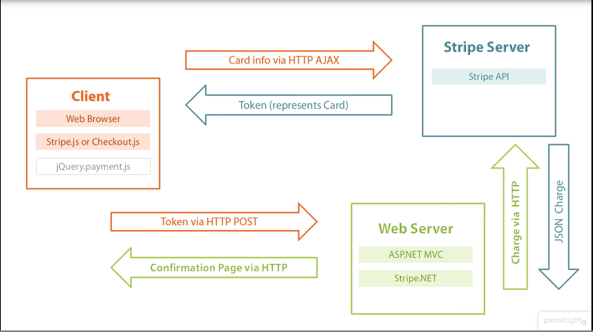

# 
**Stripe Case Study**
 

## **Overview and Origin**
### ***Origin***
Stripe was co-founded by Irish entrepreneur brothers John and Patrick Collison in 2010. They initially named the company /dev/payments, but Delaware's state does not allow leading slashes in corporate names. To overcome this problem, they eventually settled on the name Stripe. 
The company's idea originated when the brothers debated why accepting payments online was so complicated and cumbersome.

>>> "Stripe really did come about because we were really appalled by how hard it was to charge for things online." — John Collison

They set forth to solve this problem by aiming to make it simple and user-friendly. Stipe strategically focused on the software developers as their target audience and set out to develop a suite of APIs that was powerful yet easy to integrate with just a few lines of code. Their earlier success was primarily due to its appeal to the development community.
Stripe has raised $1.6 billion over 14 rounds from 8 lead Investors and 31 investors in all.
Stripe has a post-money valuation in the range of $10B+ as of Apr 16, 2020. 
<a href="#1">[1]</a>

### ***Overview***
Today, Stripe has come a long way in the online payment processing market. It still has lots of growth potential.
Stripe is a full-stack payment processor. It provides a payment infrastructure for the Internet. It combines the functionality of merchant account,  payment processor, and payment gateway all in one. It allows businesses of all sizes to set up and accept payments online and in-person easily and quickly in a user-friendly way. It has no setup fee or monthly fee but is based on a transparent per transaction fee structure, helping startups and small businesses quickly launch their business. Stripe is PCI compliant and provides fraud protection, reducing the burden to manage security and detect fraud.
It seamlessly integrates payment processing with online (websites and mobile apps using APIs), in-person (retailers) and omnichannels (using terminals), software marketplaces, and subscription businesses. It also provides built-in out-of-the-box tools for payment processing such as Radar - Fraud and risk management, Sigma - Custom reports, Dashboard, and  Identity verification. Stripe's other business operations are Atlas - Startup incorporation and Climate - Remove carbon as you grow your business. Stripe also offers financial services such as Card creation - An API for businesses to instantly create, manage, and distribute payment cards, Spend Management - to handle business expenses by corporate cards, and Business Financing.
A broad overview of services/tools offered by  Stripe are:
* Products
    * Payments:
    Stripes Payments products accept payments and move money globally with Stripe's robust APIs and software solutions designed to capture more revenue.
    <a href="#2">[2]</a>
        
    Stripe provides payment solutions to
    It seamlessly integrates payment processing with online (websites and mobile apps using APIs).  An account can be created in minutes to accept payments securely, and funds are deposited directly into the merchant account.  It offers fraud protection and increases authorization rates on every charge using machine learning and data from millions of businesses. It is available in 35 countries, supports 135+ currencies, and accepts almost all major payment methods. 
Stripe offers two integration methods.
    * Hosted Payment Page: Simply integrate pre-built checkout page hosted on Stripe using "Stripe Checkout."
    * Fully customized Solution: Complex and Unique checkout pages need more functionality and flexibility.  Stripe offers "Stripe Elements", rich, pre-built UI components to help design and built custom checkout pages as unique as the merchant. 
    * Terminal
    Stripe Terminal extends the merchant's online presence into the physical world, enabling merchants to build in-person checkout. Built with modern retailers and platforms in mind, Terminal helps unify online and offline channels with flexible developer tools, pre-certified card readers, and cloud-based hardware management. 
    <a href="#3">[3]</a>
    
    * Connect
    Stripe Connect is a set of programmable APIs and tools that facilitate payments, build a marketplace, and payout sellers or service providers globally—all while having Stripe handles payments compliance.<a href=" #4">[4]</a>It routes payments between multiple parties.
    * Billing 
Stripe Billing is the fastest way for businesses to bill customers with subscriptions or invoices. Captures more revenue, supports new products or business models and accepts recurring payments globally. <a href="#5">[5]</a>

* Business Operations
    * Radar
    Stripe Radar is a tool that uses flexible machine learning to fight fraud and increase the conversion rate of transactions using the Stripe network. It is offered as a built-in, with no additional setup. Radar helps to distinguish fraudsters from legitimate customers and applies Dynamic 3D Secure to high-risk payments.
    * Sigma
    Stripe Sigma is an analytical tool that makes transactional data available within an interactive SQL environment in the Dashboard. Sigma creates fully customized reports using information about payments, subscriptions, customers, payouts, and more.<a href="#6">[6]</a>
        
    *Dashboard:
    Stripe Dashboard offers a user interface to manage and configure the Stripe account. It is used to manages payments and refunds, respond to disputes, monitor integration, and more.<a href="#7">[7]</a> 
    
    *Atlas
    Stripe  Atlas is a platform that offers a seamless and safe way to launch a company in the U.S (Delaware) from anywhere in the globe. With just $500, a company can be formed with no lengthy paperwork, legal complexity, and numerous fees. <a href="#8">[8]</a>
    
    * Climate
    With Stripe Climate, customers can direct a fraction of their revenue to help scale emerging carbon removal technologies in just a few clicks. Join a growing group of ambitious businesses changing the course of carbon removal.  <a href="#9">[9]</a>
    
 * Financial Services
    * Corporate Cards & Issuing
    The Stripe Corporate Card are virtual and physical cards designed to instantly create, manages, and distribute payment cards to corporations. It is designed for startups and fast-growing companies.  It helps corporations to control spending, reconcile expenses automatically using software like Expensify, and earn extra cashback where they spend the most each month.
    <a href="#10">[10]</a> 
    <a href="#11">[11]</a>
    <a href="#12">[12]</a>
    
    * Treasury
    Stripe Treasury is a banking-as-a-service API that lets you embed financial services in your marketplace or platform. With a single integration, enable your customers to hold funds, pay bills, earn interest, and manage cash flow. <a href="#13">[13]</a>
    
    
    * Capital
Stripe Capital provides access to fast, flexible financing so you can manage cash flows and invest in growth.  <a href="#14">[14]</a> 

### ***Business and Revenue Model***

Stripe offers fast, reliable, secure, and simple payment processing capability for online-merchants. Creating an account is easy, fast, and convenient.  The revenue model of Stripe is straightforward. It charges 2.9% + 30¢ per successful card charge with no setup fee, monthly fee, or hidden fees. 
Stripe's mission is to increase the GDP of the Internet and help more companies get started. The transparent and straightforward fee structure aligns with the goals and motivation of its customers. The better the customer's checkout conversion rate, the better Stripe's revenues. Using this business and revenue model, Stripe has strategically positioned itself as a "toll booth" of the internet economy, collecting a fee every time a transaction is successfully processed on its platform. As the economy grows, Stripe is sure to grow along, despite a very competitive market. 
A decade later, with new companies with similar offering and products, Stripe understands to differentiate itself is no longer enough; hence they have maintained the same flat fee structure to stay competitive.  Along with score business, using the same concepts of simplicity and ease of use It has branched into new areas such as subscriptions, invoicing, or lending. This has helped with new customer acquisition and more cross-sell opportunities for existing ones.
Its acquisition of Africa's biggest payment processor – PayStack and funding of Pakistani startup - Safepay shows its intent to tap into global under-developed markets. Its launch of Atlas (a powerful, safe, and easy-to-use platform for launch a new company from anywhere without any lengthy paperwork, legal complexity, and numerous fees) has helped it beyond payment processing solutions.

## **Business Activities**

### ***Intended Customers and Market Share***
Millions of companies of all sizes—from startups to Fortune 500s—use Stripe's software and APIs to accept payments, send payouts, and manage their businesses online.
<a href="#15">[15]</a>Some well-known companies that use stripe are Amazon, Google, Zoom, Slack, and many others. 
Stripes market share in is 18.54%. It currently has 151,211 websites. <a href="#16">[16]</a>

**Industries that use Stripe**

**Distribution of Companies that use Stripe based upon revenue.**

Of all the customers that are using Stripe, a majority (73%) are small (<$50M), 7% are large (>$1000M), and 14% are medium-sized.
<a href="#17">[17]</a>

**Distribution of Stripe Customers based upon Country.**

43% of Stripe customers are in the United States, and 7% are in the United Kingdom. 
<a href="#17">[17]</a>

### ***How Stripe distinguishes Itself***
Stripe set itself apart by taking the developer-first approach.  Its open-Source API approach and core technology appeal to developers with the promise of simple integration. It also backed its well-designed API with extensive support documentation. It also offers customizable solutions for non-developers. 
It charges 1%/ transaction - currency conversion, half of what some competitors such as Braintree.
Another big advantage stripe has is that it has extensive integration with existing apps (over 400). These are called partners. If you have a problem in your e-commerce business, chances are Stripe has the solution, and if it does directly, integration with one of its partners can help solve the problem. 

### ***Problems Solves by Stripe***
Accepting payments over the web has been a complicated and cumbersome process. The online merchants had to set up a merchant account, which could take weeks and had complexities like regulations, fees, compliance standards, and more. It became increasingly even more complicated for international transactions.  Furthermore, the company had to underwrite risk and was responsible for the fraudulent transaction and returned items and face challenges with validating the buyer's Identity with "card-not-present" transactions."  All these challenges resulted in higher processing fees.  As more businesses turned to E-commerce, it created a need for a less complicated way to accept payments online quickly and simply. 
Stripe was an early user of PayFac and uses it to onboard merchants under its master merchant account. It acted as both the payment processor and as a payment gateway and communicated directly with the card network. Online merchants could now set up and accept payments instantaneously. Furthermore, Stripe assumes the risk of loss associated with fraud, chargeback, and AML. Stripe also provides tools for reporting (Its Sigma product) and a dashboard.  Stripe takes the burden of compliance and security of the merchants.
Online merchants have the challenge of "cart abandonment". This means it does not result in checkout conversion. This could be because of various reasons, on the payment processor end it could be because the user did not find its preferred payment method at checkout, the checkout process is not straightforward, or the user's card is deemed fraudulent and/or extra complicated verification is required. Stripe solves this problem by making the checkout as seamless as possible.  It supports almost all payment methods from credit cards to e-wallets to ACH. It also uses the preferred payment method of a region i.e. AliPay or WebPay in china. This helps merchants to broaden their client base globally.  Stripe uses 3D secure 2.0 to authenticate high-risk users to provide frictionless authentication were supported by the issuing bank.  3D secure 2, uses the issuing bank's app to verify, either using a fingerprint or even facial recognition.  
Another problem that the merchant faces if of chargeback. A chargeback is demanded by the issuing credit card to reverse a certain transaction. This is different from a refund, where a merchant requests to reverse a transaction. The most common chargeback is the customer complaining to the issuing bank that their card is used fraudulently.  In chargeback, the customer gets his money back at the loss of a merchant. Besides the chargeback itself, the merchant has to pay the various fee and fines associated with the chargeback. It's estimated that every dollar charged back actually costs the merchant 2.40.<a href="#18">[18]</a>

 Disputing chargebacks are time-consuming and cumbersome. Chargebacks carry a large risk to the merchants. Stripe solves this problem by offering Chargeback protection for a fee - just 0.4% per transaction.  Stripe uses its Radar tool to block most fraudulent transactions at checkout, cutting down the risk of chargeback. 
Two-sided marketplace (i.e. that provide product or services but also serve as a platform for people to contract to provide those products and services like - Lyft (provides a service rides and drivers as a contractor to provide the rides)  have the challenge of paying out on-demand. It takes several days for the contractors to get paid for the service they had already provided. Stripe solves this problem by its Instant Payouts. As soon as a transaction is guaranteed, the contractors get paid. Stripe made this possible by making deals with VISA and MasterCard and uses fast payment rail.

### ***Technology Stack***

#### **Overview of Stripe Architecture**

For this case study, an oversimplified overview of Stripe architecture using the .Net implementation is used.
Broadly Stripe architecture is built upon three layers. Each layer is built on SOA/microservices architecture. 
* Client - a computer/smartphone running a web browser and hosts either the stripe.js, or Stripe.checkout.
* Application Web Server - hosting the merchant application, this will host the stripe client libraries that the merchant apps use to communicate with Stripe Server.
* Stripe Server - hosting the API. These are in actual sense multiple load balancing  servers running on cloud infrastructure

[Source : plurarSight](./Stripe-Net-Architecture.png)

The Client posts credit card information to the stripe server via HTTPS. The Stripes API stores this information and returns a single-use token to the client. The browser then posts this token to the merchant application, which then calls the Stripe Server using the API to charge the card represented by the token. The Stripe server returns a JSON charge object. The merchant server app sends a confirmation/denial page back to the client browser. So the credit card never passed to the merchant server, which takes the burden of compliance of the merchants.

#### **Stripe APIs**

Stripe APIs are built in Ruby language using Restful architecture. APIs have predictable resource-oriented URLs, accept form-encoded request bodies, return JSON-encoded responses, and uses standard HTTP response codes, authentication, and verbs. <a href="#19">[19]</a>
 It uses API-keys for authentication requests. There are two types of API keys, Publishable and Secret. The publishable keys are public keys used to identify the customer with Stripe on client-facing code such as stripe.js, it has access to limited strips API requests. The secret key, as the name suggests is confidential and only stored on the merchant's server, it can be used to perform any API request with Stripe.

#### **Client Libraries**

Stripe provides official libraries for different programming languages and mobile platforms
such as Ruby, Python, PHP, Java, Node.js, Go and .Net, Android and iOS.

#### **Database and NOSql storage**

Stripe uses Postgres, Apache Hadoop and Redis. <a href="#20">[20]</a>

Postgres is a free and open-source relational database management system emphasizing extensibility and SQL compliance. <a href="#21">[21]</a>

Apache Hadoop. Hadoop is a collection of open-source software utilities that facilitates using a network of many computers to solve problems involving massive amounts of data and computation. It provides a software framework for distributed storage and processing of big data using the MapReduce programming model. <a href="#22">[22]</a>

Redis is an in-memory data structure store, used as a distributed, in-memory key–value database, cache and message broker, with optional durability. Redis supports different kinds of abstract data structures, such as strings, lists, maps, sets, sorted sets, HyperLogLogs, bitmaps, streams, and spatial indexes. <a href="#23">[23]</a>

#### **Cloud/Hardware Infrastructure**

Stripe uses Amazon Cloud Services - AWS. AWS provides the backend infrastructure that helps with load balancing, secure networking, and physical security. The AWS services Stripe uses are S3, EC2, and Route53, Redshift, Virtual Private Cloud. 

Amazon Route 53 is a scalable and highly available Domain Name System service. 

Amazon EC2 - Elastic Compute Cloud is a part of Amazon.com's cloud-computing platform, Amazon Web Services, that allows users to rent virtual computers on which to run their computer applications. EC2 encourages the scalable deployment of applications by providing a web service through which a user can boot an Amazon Machine Image to configure a virtual machine, which Amazon calls an "instance", containing any software desired. A user can create, launch, and terminate server-instances as needed, paying by the second for active servers – hence the term "elastic". EC2 provides users with control over the geographical location of instances that allows for latency optimization and high levels of redundancy. In November 2010, Amazon switched its own retail website platform to EC2 and AWS.
 <a href="#24">[24]</a>

Amazon S3 or Amazon Simple Storage Service is a service offered by Amazon Web Services that provides object storage through a web service interface. Amazon S3 uses the same scalable storage infrastructure that Amazon.com uses to run its global e-commerce network. Amazon S3 can be employed to store any type of object which allows for uses like storage for Internet applications, backup and recovery, disaster recovery, data archives, data lakes for analytics, and hybrid cloud storage.  <a href="#25">[25]</a>

#### **Machine Learning**

Stripe's Radar uses adaptable ML to block fraud while its Billing uses ML to retry failed charges on the network. Stripe scores hundreds and millions of predictions using billions of data points using hundreds of new models.  With time, better quality, and more data, the models are trained to improve their performance. Various teams are working on ML in Stripe. Each team needs tools to train its models without re-inventing the wheel.  For this purpose, Stripe built Railyard, an API and job manager for training these models in a scalable and maintainable way. Railyard empowers the teams to independently train their models with a centrally managed ML service. Railyard is built using Kubernetes. 
Railyard empowers the various teams to independently train their models daily with a centrally managed ML service.

## **Landscape**

Stripe primarily falls under the Payment/Billing domain of Fintech. Although it has also diversified into Capital Investment via its corporate credit card lines and loans.

### ***Trends in Payment Processing Industry***
Some trends and innovations of the payment processing industry  over the past decade are as follows:

* Nonbank digital players (both technology giants and startups) entered and transformed the customer experience, reshaped the payments, and broaden the financial-services landscape. These companies disrupted the bank payment industry. Stripe and Paypal being two such companies. 
* The World Adopts Real-Time Payments. The past decade has been huge for real-time payments. RTP enables the customer to send and receive payments instantaneously. This convenience has become widely expected.
* M-commerce get real: With the advent of mobile wallet technology and widespread availability of smartphones, there has been a push to adopt M-commerce. In 2015, Apple released its digital wallet - ApplePay. Lots of companies have followed suit. By 2017, 37% of US consumers were using these online payment systems.

* Globalization: Cross-border e-commerce has seen growth in the last decade. More and more merchants are tapping into the global market and faced obstacles like international payment processing and fraud prevention. Payment Processor Companies have taken on the burden of currency conversion, regulations, and fraud prevention, freeing the merchants to concentrate on their business. As under-developed countries have seen a demand for payment processing, lots of companies have made their services available, handling all country-specific regulations, currency, preferred payment locally.

* Frictionless Payments gained favor. Fast and secure payments have become the norm over the past decade. Customers have come to expect a frictionless payment as a standard. More and more banks are supporting 3D Secure 2.0, which makes high-risk payments seamless and user-friendly.  

* Widen Payment methods. So many payment methods were introduced in the last decade from digital-wallets to new cards, to cryptocurrency. The customers have come to expect that they should be able to pay with their preferred payment type. Payment Processors have increasingly accommodated this demand by offering multiple payment types.

* Contact-less payments. More recently (2019), as Covid19 has upended life with lockdown, restrictions, and concerns of health safety, the demand for contactless payments technology i.e.radio-frequency identification (RFID) or near field communication (NFC) has grown for secure payments. The customer can just wave a card, fob, or handheld device embedded with an integrated circuit chip and antenna over a reader at the POS terminal and make a payment without touching anything. This works only when customers are in close physical proximity with the Terminal.  

* AI makes a mark
 Adaptive AI-driven fraud approaches have been widely used to fight fraud. Most companies in the market offer some sort of AI fraud protection. 

### ***Stripe Competitors***
 Some of the other major companies in the domain are PayPal, Braintree, Square, and Adyen.

## **Results** 
### ***Impact of Stripe***
Stripe has had a huge impact on the payments industry. It was one of the first to identify a need and fulfill it. Stripe has helped online merchants to minimize the cost of building, running, and maintaining their own payment solutions and improve the quality of the checkout experience. It has helped increase checkout conversion rates, reach new global markets, accept alternative payment methods, and streamlined the integration of partners and sellers.
Customers reported increase in revenues by 6.7%, developer increase in productivity by 59%, unplanned Outages decreased by  81%  and 24% lower cost of operations.<a href="#15">[15]</a> 

### ***Core Metrics***
Since the payment processor domain is primarily based upon charging the customer a fixed and percent fee per every successful transaction, the KPIs of this domain are as follows:
1.  Conversion Rate (% of transactions successful)
2.  Total Payment Volume (a measure of the dollar volume transacted on the platform)
3.  Active customer accounts: (# of customers actively using the platform to process payments)
4.  Payments transactions per active account 
5.  New User Account Creation Rate
6.  Rate of loss of existing User Account
6.  Error Rate
7.  Decline Rate (by Policy, Risk, and Issuer)
8.  False Positive Rate (declined users who were authentic, based on test and control analysis)
9.  Uptime (% of the time the payment processor is up & running)

Stripe, being a private company, does not have much information about the KPIs mentioned above. 
Some KPIs that paypal (a company in the same domain) uses are as follows:<a href="#26">[26]</a> 

1. Total Payment Volume: a measure of the dollar volume transacted on the platform. Payments processors strive to consistently increase TPV.  This can be done by paying close attention to the other two key metrics: 
-   Active customer accounts: The more customers actively use the platform to process payments, the better the company's performance.   
-   Payments transaction per active account:  If the more transactions an active customer makes on the platform, the better the TPV. Total Net Revenues
2. Total Net Revenue: total sales revenues, after subtracting things like sales discounts, fraudulent transactions, etc. 
3. Cost of Net Revenue
4. Transaction losses

### ***Comparisiom of Stripe with Competitors***
#### ***Stripe Vs Paypal***
Although PayPal is the leading company in the payment processing domain, It holds a market share of 54.5% with 445,763 websites using its platform. <a href="#27">[27]</a> Stripe is growing at a very fast pace. 
PayPal and Stripe both offer similar services and products, similar fee structure, reliability, security, and add-on services/products and tools. Which company is preferred is based upon the merchant needs, Country, and industry.

##### **Ease of Use & Customizability**
Both Stripe and Paypal are simple and easy to use. Paypal is more plug-and-play and can be integrated with simple cut and paste. Stripe, on the other hand, is slightly less simple but provides the capability to customize the checkout experience. Software developers prefer Stripe for all the customization functionality it provides, while merchants want simple out of the box payment solution, prefer Paypal.

##### **International Support**
Stripe is currently available in 39+ countries and also supports 135 currencies. Paypal on the other hand is available in 200+ counties but supports only  25 currencies.
Stripe supports various local payment methods.
Stripe offers precise control on how to handle foreign currency. Furthermore, Stripe provides the ability to avoid exchange fees by specifying "presentment" currencies when you set Stripe up. Stripe keeps separate balances for each currency.  If the presentment currency is different from settlement currency, then Stripe will charge a 1% fee. 
Paypal on the other hand accepts international payments by a toggle feature on your account. It provides a way to specify if currency should be automatically converted to US dollars or done manually. Currencies are held in the account until ready to be converted.

Paypal is more widely available and Stripe offers more control over International transactions.

##### **Security**
Both Stripe and Paypal are secure and meets PCI compliance.

Stripe, however, provides extra fraud protection called Radar. Radar uses adaptive machine learning algorithms to analyze data across millions of transactions on its platform to identify fraudulent transactions. This is included in the standard plans.
Stripe's Chargeback protection feature waives all dispute fees and Stripe covers the disputed amount.

##### **Payment Methods and Types Accepted**
|       |   Stripe  |  Paypal   | 
|:-:    |:-:    |:-:    |
| PaymentMethods    |  AliPay, Android Pay, Apple Pay, ACH,  China UnionPay, Maestro, WebPay| PayPal, Google Play|      |
|   PaymentCards    |   Visa, MasterCard, AMEX, and others  |  Visa, MasterCard, AMEX, and others   |   |       |       |

Stripe offers more methods of payment. But PayPal is a household name that is already widely used. Stripe supports ACH while Paypal does not.

##### **POS**
POS is not a strength of either PayPal or Stripe. Paypal provides more offers more mature POS options and at a better processing rate.

##### **Fee Comparison**
Stripe and Paypal have similar fee structures.  
|       |   Stripe  |  Paypal   | 
|:-:    |:-:    |:-:    |
|   Transaction fee |   2.9% +$0.30     |  2.9% +$0.30  |
|  Nonprofit discount   |   2.2% + $0.30    |   2.2% + $0.30    |
| International transactions    |  +1% for international cards, plus 1% for currency conversion     |   4.4% per transaction, fixed fee based on currency   |
|  Invoicing    |  Free     |   Free    |
|  Recurring billing    |   0.5%    |   Not Available   |
|   Micropayment fees (for pur  |   2.9% + $0.30    |   5.0% to 6.5% + fixed currency fee   |
|   ACH direct debit, credit, or wire transfers for large transactions  |   0.8% up to $5   |   Requires Braintree integration  |
|   Instant payouts |   1% with $0.50 minimum   | 1% up to $10.00   |
|   Chargeback fees |   Fixed fee per currency ($15 for the U.S.)   |   Fixed fee per currency ($20 for the U.S.)   |
|   Chargeback protection   |  0.4% per transaction     |   Not available   |
| Fraud protection      |   2.7% + $0.05 per swipe + 1% for international cards + 1% for currency conversion    |   2.7% per swipe in U.S., 4.2% per swipe outside U.S., 3.5% + $0.15 for manual transactions, 1.5% for cross-border transfers  |
|   Pre-certified card readers  |   $59 to $299 |  Free to $79.99   |
|       |       |       |

[Source : edesk](https://blog.edesk.com/resources/paypal-vs-stripe/)

#### ***Stripe Vs BrainTree***

BrainTree (a subsidiary of PayPal) is the leading competitorStripe. It holds a market share of 2.21% with 18,048 websites using its platform. <a href="#28">[28]</a>

Braintree and Stripe both offer similar services and products, similar fee structure, reliability, security, and add-on services/products and tools. Which company is preferred is based upon the merchant needs, Country, and industry.

The major differences between Stripe and Braintree are as follows
##### **Payments**
* Bitcoin Support:
Braintree supports Support bitcoin while Stripe discontinued support in 2018
* Chargeback:
Both Stripe and Braintree charge the industry standard $15 fee for chargebacks but Stripe will refund the fee if the customer is found to be at fault and the chargeback is not upheld. Furthermore, Stripe provides the Chargeback Protection feature.
* Payment Method:
Braintree accepts Venmo and Paypal. While Stripe accepts AliPay and WebPay.
* International Payment:
Both Stripe and Braintree process charges in  130+ currencies. But Braintree charges an additional 1% fee for international payments, Stripe too charges 1% but also provides the ability to avoid exchange currency fees by specifying "presentment" currencies when you set Stripe up. 
##### **Merchant Account**
With Braintree, a merchant can sign up for either a full-stack payment (both processor and gateway) or just for a payment gateway. But Stripe does not offer payment gateway stand-alone, merchants have to sign up for the merchant account, processor, and gateway all in one.
##### **Integrations with Other Services**
* Stripe has a vast partner program, Stripe integrates with over 300+ existing apps including Accounting, analytics, ordering, CRM, POS, financing, forms, inventory management, invoicing, mobile payments, notifications, transaction monitoring, relay, referral marketing, recurring subscriptions, user management, and shipping. Braintree which integrates with only 40+. Customer ###Service Reputation
Braintree has a much better support service than Stripe.

#### ***Stripe Vs Square***
Square is the leading competitor of Stripe. It holds a market share of 2.34% with 19,139 websites using its platform. <a href="#29">[29]</a>

Stripe and Square target similar-sized companies that do not pay monthly transactions, do not want to be burdened by compliance issues, expensive payment processing equipment, and complicated contracts.  
Both companies offer similar, automated direct deposits within a few days of processing each transaction, so clients will have fast access to cash after each payment takes

Stripe and Square both offer in-person payments and online payment processing payments. Square strength lies in POS payments while Stripe is predominantly used for online payments. 
Stripe launched its POS solution called Stripe Terminal in 2018. Before that Stripe focused mainly on online transactions. Square's card reader and POS for accepting mobile payments in-person are 100% free.
 The major difference between Stripe and Square are as follows:
||Square|Stripe|
|--- |--- |--- |
|In-person payment processing cost|2.6% + $0.10|2.7% + $0.10|
|Online payment processing cost|Starting at 2.9% + $0.30|Starting at 2.9% + $0.30|
|Hardware|Better for brick-and-mortar businesses|Better for online businesses|
|Software|Best for brick-and-mortar businesses|Better for online businesses|
|ACH debit transactions| 0.8% ($5 cap)| N/A|
|Payment Methods| Cash, Checks, All credit Cards, | |
|Recurring / card-on-file transactions| 2.9% + 30 cents plus 0.5% after 1st million | 3.5% + 15 cents |
| ease of use|X||
|Payment options||X| 
[Source: fundera.com ](https://www.fundera.com/blog/stripe-vs-square)

 ## **Recommendations**

Stripe discontinued accepting bitcoin in 2018, citing its volatility and time for settlement as major issues. With Elton Musk investing in bitcoin and IBM's launch of its StableCoin, digital currency is set to make a comeback without the volatility of bitcoin of the old days. It will be advisable for Stripe to re-introduce support for cryptocurrency. Paypal has already announced its intention to support StableCoin. 

What technologies would this additional product or service utilize?
The foundation of Cryptocurrency is Blockchain.  Blockchain.com (formerly Blockchain.info) is a cryptocurrency blockchain explorer service, as well as a cryptocurrency wallet and a cryptocurrency exchange supporting Bitcoin, Bitcoin Cash, and Ethereum. They also provide Bitcoin data charts, stats, and market information.
 <a href="#30">[30]</a>

Blockchain would be appropriate for payment processing for the following reasons<a href="#31">[31]</a>:  
* Speed up to cross border payment processing : 
* Reduce International Payment Processing Fee/Cost
The foreign exchange rate, tax charges, international charges, and international payment fees, make cross-border payments in different currencies very expensive. Although not free with blockchain, as blockchain will also charge a fee, but it will greatly reduce the international payment currency cost.
* Verification
Blockchain by its nature comes with an identity verification system. Furthermore, data is stored in is a secure data storage system that is incorruptible.
* Benefit of Wallet
The blockchain payment gateway offers a digital virtual wallet that keeps track of every detail regarding cryptocurrency.
* Insurance Claims/Smart Contracts
There can still be disputes between parties despite being a very secure technology. Insurance claims can be filed, but particular requirements need to be fulfilled before filing. The option of smart contracts keeps a vigilant check to avoid the occurrence of any unforeseen situation.

## **References**

1. https://www.crunchbase.com/organization/stripe/company_financials
2. https://stripe.com/payments
3. https://stripe.com/terminal
4. https://stripe.com/connect
5. https://stripe.com/billing
6. https://stripe.com/radar
7. https://stripe.com/docs/dashboard
8. https://stripe.com/docs/Atlas
9. https://stripe.com/docs/climate
10. https://stripe.com/blog/introducing-stripe-corporate-card
11. <a name="11">https://stripe.com/docs/corporate-card
12. https://stripe.com/docs/issuing/cards
13. https://stripe.com/treasury
14. https://stripe.com/Capital
15. https://stripe.com
16. https://www.datanyze.com/market-share/payment-processing--26/stripe-market-share
17. https://enlyft.com/tech/products/stripe
18. https://www.verifi.com/in-the-news/much-chargeback-fee/
19. https://stripe.com/docs/api
20. https://techstacks.io/stacks/stripe/
21. (https://en.wikipedia.org/wiki/PostgreSQL
22. https://en.wikipedia.org/wiki/Hadoop
23. https://en.wikipedia.org/wiki/Redis
24. https://en.wikipedia.org/wiki/Amazon_Elastic_Compute_Cloud
25. https://en.wikipedia.org/wiki/Amazon_S3
26. https://www.fool.com/investing/general/2016/03/28/key-metrics-how-paypal-boosts-transaction-volume.aspx)
27. https://www.datanyze.com/market-share/payment-processing--26/paypal-market-share
28. https://www.datanyze.com/market-share/payment-processing--26/braintree-market-share
29. https://www.datanyze.com/market-share/payment-processing--26/square-payments-market-share
30. https://en.wikipedia.org/wiki/Blockchain.com
31. https://techblogcorner.com/2020/03/12/benefits-of-using-blockchain-based-payment-gateways/#:~:text=%206%20Benefits%20of%20Using%20Blockchain%20Based%20Payment,has%20still%20left%20a%20scale%20of...%20More
32. [fundera](https://www.fundera.com/blog/stripe-vs-braintree#:~:text=Another%20critical%20difference%20between%20Stripe%20vs.%20Braintree%20is,payments,%20and%20groups%20together%20merchants%20when%20conducting%20transactions)
33. https://www.cbinsights.com/research/report/stripe-teardown/
34. https://www.brainyquote.com/quotes/john_collison_542589
35. https://www.investopedia.com/terms/c/contactless-payment.asp
36. https://techcrunch.com/2017/06/01/stripe-sigma-data-analytics/#:~:text=payments%20data%20%7C%20TechCrunch-,Stripe%20launches%20Sigma%2C%20a%20new%20analytics%20tool,help%20businesses%20track%20payments%20data&text=Sigma%20is%20a%20fully%20customizable,their%20own%20data%20analytics%20tooling
37. https://en.wikipedia.org/wiki/Stripe_company
38. https://www.startupgrind.com/blog/the-collison-brothers-and-story-behind-the-founding-of-stripe/
39. https://www.producthunt.com/alternatives/stripe-atlas-pre-launch
40. https://stripe.com/docs
41. https://www.wikisme.com/stripe-swot/#:~:text=%202)%20Weaknesses%20of%20Stripe:%20%201%20API,processing%20fees%20is%20at%20par%20with...%20More
42. https://www.wikisme.com/stripe-swot/

